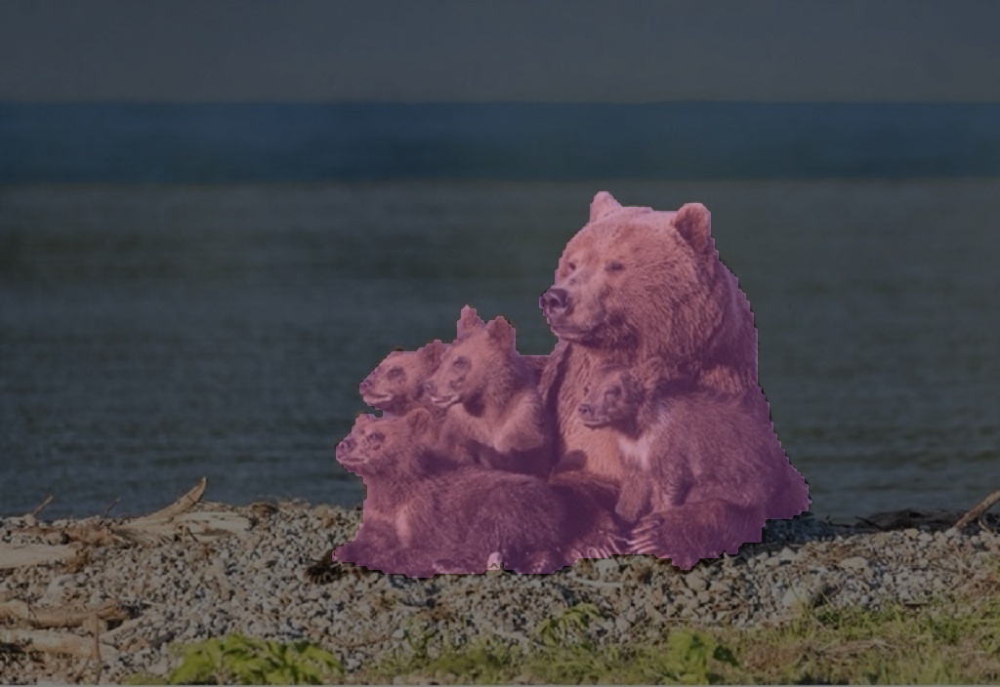

English| [简体中文](./README_cn.md)

Getting Started with mono edgesam
=======

# Feature Introduction

The mono edge sam package is a usage example based on [edge SAM](https://github.com/chongzhou96/EdgeSAM) quantification deployment. The image data comes from local image feedback and subscribed image msg. SAM relies on the input of the detection box for segmentation, and segments the targets in the detection box without specifying the category information of the targets, only providing the box. 

In this example, we provide two deployment methods:
-Regular box for segmentation: A detection box in the center of the image is fixed for segmentation.
-Subscription box for segmentation: Subscribe to the detection box information output by the upstream detection network and segment the information in the box.

# Development Environment

- Programming Language: C/C++
- Development Platform: X5/S100/S600
- System Version: Ubuntu 22.04/Ubuntu 24.04
- Compilation Toolchain: Linaro GCC 11.4.0/Linaro GCC 13.3.0

# Compilation

- X5 Version: Supports compilation on the X5 Ubuntu system and cross-compilation using Docker on a PC.

- S100 Version: Supports compilation on the S100 Ubuntu system and cross-compilation using Docker on a PC.

- S600 Version: Supports compilation on the S600 Ubuntu system and cross-compilation using Docker on a PC.

It also supports controlling the dependencies and functionality of the compiled pkg through compilation options.

## Dependency Libraries

- OpenCV: 3.4.5

ROS Packages:

- dnn node
- cv_bridge
- sensor_msgs
- hbm_img_msgs
- ai_msgs

hbm_img_msgs is a custom image message format used for image transmission in shared memory scenarios. The hbm_img_msgs pkg is defined in hobot_msgs; therefore, if shared memory is used for image transmission, this pkg is required.

## Compilation Options

1. SHARED_MEM

- Shared memory transmission switch, enabled by default (ON), can be turned off during compilation using the -DSHARED_MEM=OFF command.
- When enabled, compilation and execution depend on the hbm_img_msgs pkg and require the use of tros for compilation.
- When disabled, compilation and execution do not depend on the hbm_img_msgs pkg, supporting compilation using native ROS and tros.
- For shared memory communication, only subscription to nv12 format images is currently supported.## Compile on X3/Rdkultra Ubuntu System

1. Compilation Environment Verification

- The RDK Ubuntu system is installed on the board.
- The current compilation terminal has set up the TogetherROS environment variable: `source PATH/setup.bash`. Where PATH is the installation path of TogetherROS.
- The ROS2 compilation tool colcon is installed. If the installed ROS does not include the compilation tool colcon, it needs to be installed manually. Installation command for colcon: `pip install -U colcon-common-extensions`.
- The dnn node package has been compiled.

2. Compilation

- Compilation command: `colcon build --packages-select mono_edgesam`

## Docker Cross-Compilation

1. Compilation Environment Verification

- Compilation within docker, and TogetherROS has been installed in the docker environment. For instructions on docker installation, cross-compilation, TogetherROS compilation, and deployment, please refer to the README.md in the robot development platform's robot_dev_config repo.
- The dnn node package has been compiled.
- The hbm_img_msgs package has been compiled (see Dependency section for compilation methods).

2. Compilation

- Compilation command:

  ```shell
  # RDK X5
  bash robot_dev_config/build.sh -p X5 -s mono_edgesam

  # RDK S100
  bash robot_dev_config/build.sh -p S100 -s mono_edgesam

  # RDK S600
  bash robot_dev_config/build.sh -p S100 -s mono_edgesam
  ```

- Shared memory communication method is enabled by default in the compilation options.

## Notes


# Instructions

## Dependencies

- mipi_cam package: Publishes image messages
- usb_cam package: Publishes image messages
- websocket package: Renders images and AI perception messages

## Parameters

| Parameter Name      | Explanation                            | Mandatory            | Type | Default Value       |                                                                  |
| ------------------- | -------------------------------------- | -------------------- | ------------------- |------------------------------------ |----------------------------------- |
| cache_len_limit          | the length of the cached image buffer            | 否                   | int | 8                   |
| feed_type           | Image source, 0: local; 1: subscribe   | No                   | int |0                   |
| image               | Local image path                       | No        | string           | config/4.jpg     |
| encoder_model_file_name               | encoder model file name                       | No        | string           | config/edgesam_encoder_1024.bin     |
| decoder_model_file_name               | decoder model file name                       | No        | string           | config/edgesam_decoder_1024.bin     |
| is_sync_mode  | 0: Synchronous Inference, 1: Asynchronous Inference        | 否                   | int | 0                   |                                                                         |
| is_shared_mem_sub   | Subscribe to images using shared memory communication method | No  | int |0                   |
| is_regular_box  | is use regular box | 否                   | int | 0                   |
| is_padding_seg  | is padding segmetation result        | 否                   | int | 0                   |
| dump_render_img     | Whether to render, 0: no; 1: yes       | No                   | int |0                   |
| ai_msg_sub_topic_name | Topic name for subscribing ai msg to change detect box | No | string | /hobot_dnn_detection |
| ai_msg_pub_topic_name | Topic name for publishing intelligent results for web display | No | string | /perception/segmentation/edgesam |
| ros_img_sub_topic_name | Topic name for subscribing image msg | No | string | /image |

## Instructions

- Topic control: mono_edgesam supports controlling detection boxes through ai msg topic messages, as an example:

```shell
ros2 topic pub /hobot_dnn_detection ai_msgs/msg/PerceptionTargets '{"targets": [{"rois": [{"rect": {"x_offset": 96, "y_offset": 96, "width": 192, "height": 96}, "type": "anything"}]}] }'
```

## Running

## Running on RDK Ubuntu System

Running method 1, use the executable file to start:
```shell
export COLCON_CURRENT_PREFIX=./install
source ./install/local_setup.bash
# The config includes models used by the example and local images for filling
# Copy based on the actual installation path (the installation path in the docker is install/lib/mono_edgesam/config/, the copy command is cp -r install/lib/mono_edgesam/config/ .).
cp -r install/lib/mono_edgesam/config/ .

# Run mode 1:Use local JPG format images for backflow prediction:

ros2 run mono_edgesam mono_edgesam --ros-args -p feed_type:=0 -p image:=config/4.jpg -p image_type:=0 -p dump_render_img:=1

# Run mode 2: Use shared memory communication method (topic name: /hbmem_img) to segmetation with regular box:

ros2 run mono_edgesam mono_edgesam --ros-args -p feed_type:=1 -p is_shared_mem_sub:=1 -p is_regular_box:=1 --ros-args --log-level warn

# Run mode 3: Shared memory communication method (topic name: /hbmem_img), set the controlled topic name (topic name: /hobot_dnn_detection) to and set the log level to warn. At the same time, send a ai topic (topic name: /hobot_dnn_detection) in another window to change the detection box:

ros2 run mono_edgesam mono_edgesam --ros-args -p feed_type:=1 --ros-args --log-level warn -p ai_msg_sub_topic_name:="/hobot_dnn_detection"

ros2 topic pub /hobot_dnn_detection ai_msgs/msg/PerceptionTargets '{"targets": [{"rois": [{"rect": {"x_offset": 96, "y_offset": 96, "width": 192, "height": 96}, "type": "anything"}]}] }'
```

Running method 2, use a launch file:

```shell
export COLCON_CURRENT_PREFIX=./install
source ./install/setup.bash
# Copy the configuration based on the actual installation path
cp -r install/lib/mono_edgesam/config/ .

# Configure MIPI camera
export CAM_TYPE=mipi

# Mode 1: Start the launch file, run sam node only.
ros2 launch mono_edgesam sam.launch.py

# Mode 2: Start the launch file, run sam node with yolo world node.
ros2 launch mono_edgesam sam_with_dosod.launch.py
```

## Run on Buildroot system:

```shell
export ROS_LOG_DIR=/userdata/
export LD_LIBRARY_PATH=${LD_LIBRARY_PATH}:./install/lib/

# Copy the configuration used by the example and the local image used for inference
cp -r install/lib/mono_edgesam/config/ .

# Run mode 1:Use local JPG format images for backflow prediction:

./install/lib/mono_edgesam/mono_edgesam --ros-args -p feed_type:=0 -p image:=config/4.jpg -p image_type:=0 -p dump_render_img:=1

# Run mode 2: Use shared memory communication method (topic name: /hbmem_img) to segmetation with regular box:

./install/lib/mono_edgesam/mono_edgesam --ros-args -p feed_type:=1 -p is_shared_mem_sub:=1 -p is_regular_box:=1 --ros-args --log-level warn

# Run mode 3: Shared memory communication method (topic name: /hbmem_img), set the controlled topic name (topic name: /hobot_dnn_detection) to and set the log level to warn. At the same time, send a ai topic (topic name: /hobot_dnn_detection) in another window to change the detection box:

./install/lib/mono_edgesam/mono_edgesam --ros-args -p feed_type:=1 --ros-args --log-level warn -p ai_msg_sub_topic_name:="/hobot_dnn_detection"

ros2 topic pub /hobot_dnn_detection ai_msgs/msg/PerceptionTargets '{"targets": [{"rois": [{"rect": {"x_offset": 96, "y_offset": 96, "width": 192, "height": 96}, "type": "anything"}]}] }'
```

# Results Analysis

## Results Display

log:

Command executed: `ros2 run mono_edgesam mono_edgesam --ros-args -p feed_type:=0 -p image:=config/4.jpg -p dump_render_img:=1`

```shell
[WARN] [1752828713.164111693] [mono_edgesam]: Parameter:
 cache_len_limit: 8
 dump_render_img: 1
 feed_type(0:local, 1:sub): 0
 image: config/4.jpg
 encoder_model_file_name: config/edgesam_encoder_1024.bin
 decoder_model_file_name: config/edgesam_decoder_1024.bin
 is_regular_box: 0
 is_padding_seg: 0
 is_shared_mem_sub: 1
 is_sync_mode: 0
 ai_msg_pub_topic_name: /perception/segmentation/edgesam
 ai_msg_sub_topic_name: /hobot_dnn_detection
 ros_img_sub_topic_name: /image
[BPU_PLAT]BPU Platform Version(1.3.6)!
[HBRT] set log level as 0. version = 3.15.55.0
[DNN] Runtime version = 1.24.5_(3.15.55 HBRT)
[A][DNN][packed_model.cpp:247][Model](2025-06-16,10:46:58.290.296) [HorizonRT] The model builder version = 1.24.3
[A][DNN][packed_model.cpp:247][Model](2025-06-16,10:46:58.561.595) [HorizonRT] The model builder version = 1.24.3
[INFO] [1750042018.628375694] [mono_edgesam]:
Model Info:
name: edgesam_encoder.
[input]
 - (0) Layout: NCHW, Shape: [1, 3, 1024, 1024], Type: HB_DNN_IMG_TYPE_NV12.
[output]
 - (0) Layout: NCHW, Shape: [1, 256, 64, 64], Type: HB_DNN_TENSOR_TYPE_F32.

Model Info:
name: edgesam_decoder.
[input]
 - (0) Layout: NCHW, Shape: [1, 1, 4, 1], Type: HB_DNN_TENSOR_TYPE_F32.
 - (1) Layout: NCHW, Shape: [1, 256, 64, 64], Type: HB_DNN_TENSOR_TYPE_F32.
[output]
 - (0) Layout: NONE, Shape: [1, 1, 1, 4], Type: HB_DNN_TENSOR_TYPE_S16.
 - (1) Layout: NCHW, Shape: [1, 4, 256, 256], Type: HB_DNN_TENSOR_TYPE_S8.

[INFO] [1752828713.949130093] [mono_edgesam]: seg result size: 720896 valid_h: 704 valid_w: 1024
[INFO] [1752828714.000021486] [sam ouput parser]: Draw result to file: render_sam_feedback_0_0.jpeg
```

## Render img:


Note: Preprocessing Image involves scaling and padding.